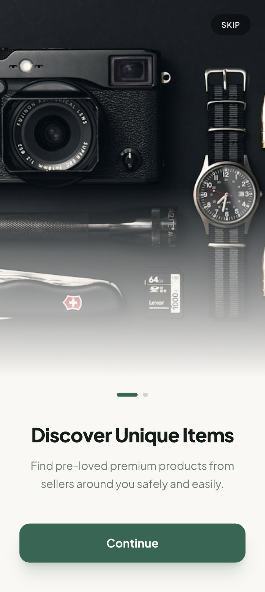
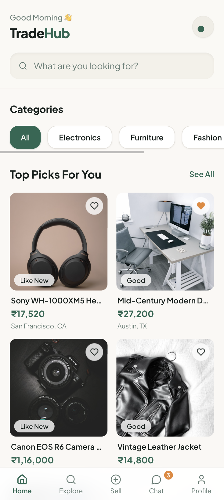
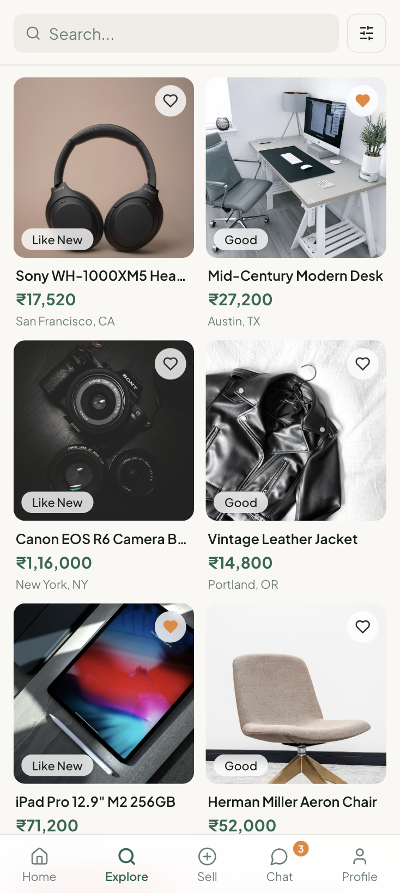
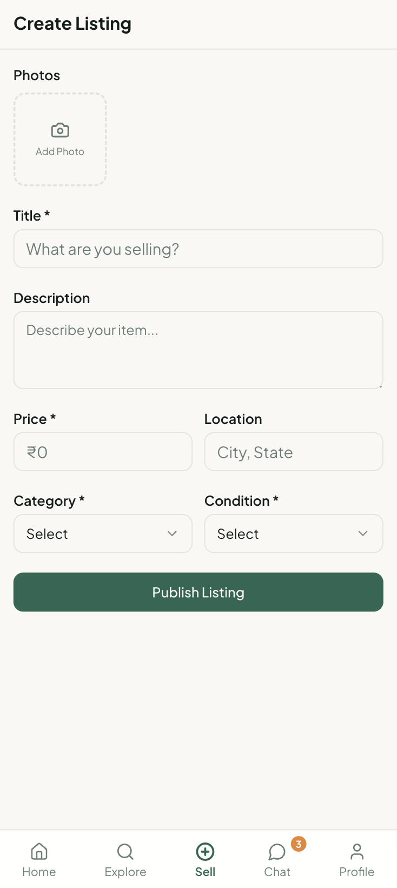
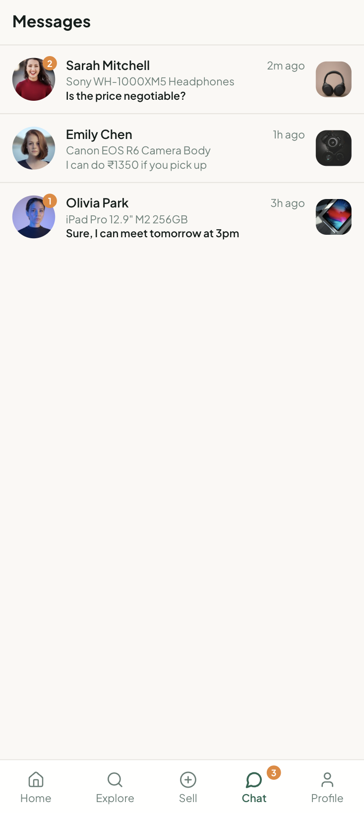
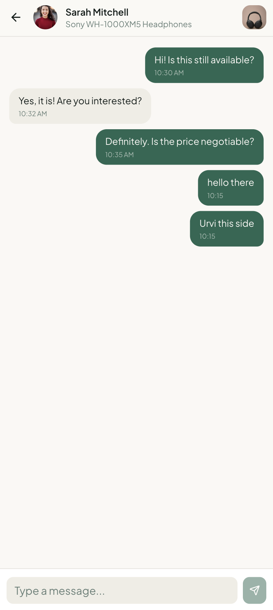
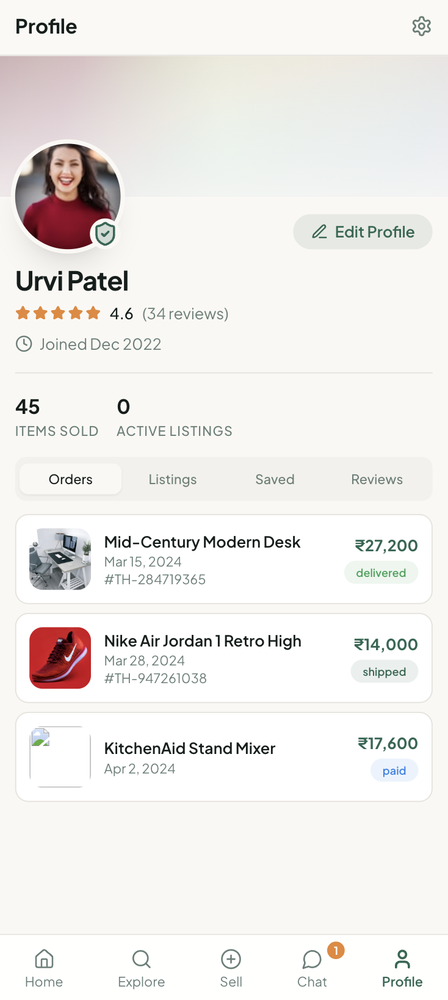
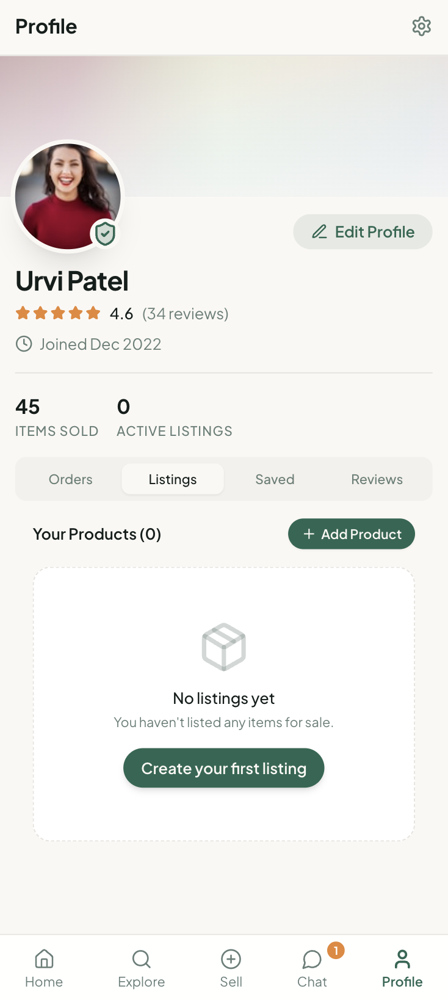
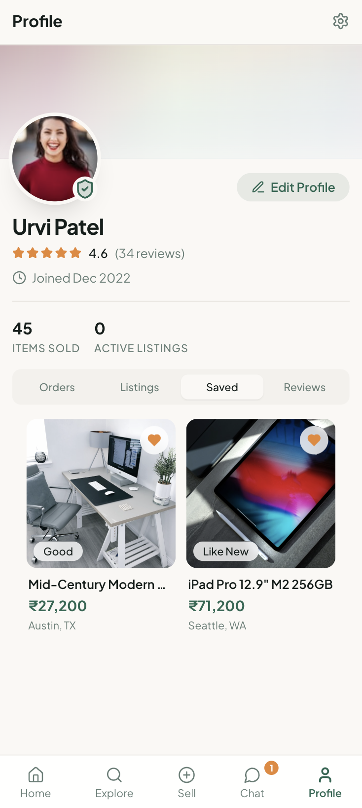
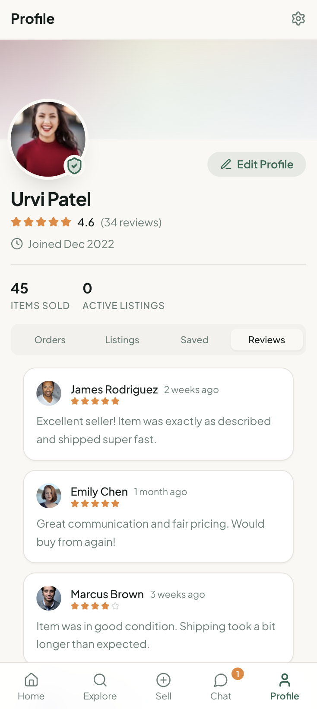

# TradeHub 🛒

TradeHub is a sleek, premium peer-to-peer marketplace mobile application built with **React Native and Expo**. It features a modern, mobile-first design that allows users to discover, buy, and sell pre-loved local premium products seamlessly.

## ✨ Features
- **🚀 Immersive Onboarding:** A visually stunning animated splash screen that transitions into an intuitive, interactive onboarding flow.
- **💎 Premium UI/UX:** Built with modern design principles featuring frosted glass layouts, subtle micro-animations, and fluid, dynamic interfaces.
- **🔍 Seamless Product Discovery:** Advanced search and category filtering with detailed property listings strictly tailored for the Indian market (₹).
- **💬 Real-time Direct Chat:** A built-in messaging ecosystem allowing users to negotiate prices and communicate directly with sellers instantly.
- **👤 Comprehensive User Profiles:** An all-in-one personal dashboard to effortlessly manage active listings, track orders, and view saved items.
- **📦 Frictionless Selling:** A streamlined flow to turn your items into cash—upload photos, add descriptions, and go live in seconds.

## 🚀 Quick Start
To run this project locally on your machine:

```bash
# Clone the repository
git clone https://github.com/urvi777/TradeHUB.git

# Navigate to the project directory
cd TradeHUB

# Install dependencies
npm install

# Start the Vite development server
npm run dev
```

Navigate to `http://localhost:8080/` in your browser!

## 📸 Screenshots

Here is a look at the application in action:

<div align="center">
  
  
  
</div>

<div align="center">
  
  
  
</div>

<div align="center">
  
  
  
</div>

<div align="center">
  
  
</div>

<br/>

## 🛠️ Tech Stack
- **App Framework**: React Native + Expo
- **Styling**: React Native StyleSheet & Reanimated
- **UI Components**: Native Containers & Lucide React Native
- **State Management**: React Context API & AsyncStorage
- **Routing**: Expo Router

---
*Created with ❤️ by Urvi Patel*
